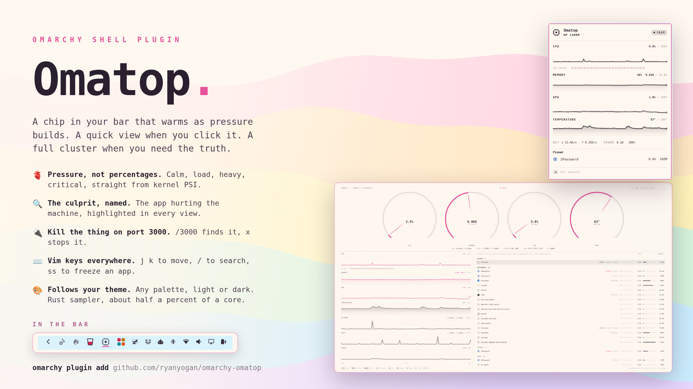

# Omatop

A system monitor for [Omarchy](https://omarchy.org) that shows you the culprit. Quiet glyph in the bar, clean stats on click, and a full-screen instrument cluster on right-click or `Super+Ctrl+M`. Vim keys everywhere.



Thirty seconds of the cluster working for a living: the ignition sweep, focusing an App so the dials re-point and its timelines slide into the ledger, the port search, the core row lighting up under real load, and the whole surface recolouring live through Tokyo Night, Catppuccin Latte and Gruvbox. [Watch the demo](assets/demo.mp4).

## What you get

**In the bar.** A small chip mark. It wears your theme foreground while the machine is calm, then shades amber, orange and red as the kernel reports real pressure. It never moves; the colour is the whole signal. Left click opens the quick view, right click opens the cluster.

**The quick view.** CPU, memory, GPU and temperature as glowing timelines, one stable net and power line, and the Apps you pinned. Nothing in it reorders. Press `o` to jump to the cluster.

**The cluster.** No card, just instruments on a dark scrim. Four dials sweep on open like a car cluster, then settle into a reading every five seconds and glide to the next: CPU, memory, GPU, temperature. Under them, a trip computer row for net, disk, power, load and uptime. Below that the ledger: every vital on one shared two minute axis, scrolling every second, so a spike in one lines up with a spike in another. Under the CPU timeline, one block per core on the same calm, amber, red ramp, so a single pinned core shows as one hot block while the total still reads 4%. The quick view has the same row. Hover or press `,` `.` to scrub back in time and read every strip at that instant.

**Offenders, without the jumping.** The panel you actually read: the top Apps by 30 second average CPU and memory, listed alphabetically with themed icons and meter bars. Membership is re-picked at most every 30 seconds, so the set is stable and the numbers move inside it. No row ever leaps to the top because something sneezed.

**Apps, not PIDs.** One row per application (Chromium is one row, not forty), alphabetical inside User, System, Desktop and Kernel sections. Tab jumps between sections. Rows never reorder by usage, so what you are looking at stays where it is. Focus a row and the dials re-point at that App: the needles glide from the machine's values to Chromium's, and its own timelines slide into the ledger on the same axis. Press `o` to unfold its processes.

**Recent, on top, never moving.** Things you just started from a terminal (`npm run dev`, `cargo build`, `docker compose up`) and recently launched apps sit in a strip at the top, newest first. They never get re-sorted by usage, and each shows its listening ports. Type `/3000` to find whatever is on port 3000, press `x` to stop it. That is the whole workflow. 🎯

**Actions.** `x` stops (asks first). `ss` pauses and resumes, using the cgroup freezer so the whole app freezes atomically. `r` restarts a service. `p` pins an App so it shows in the quick view and survives restarts. The Desktop bucket (compositor, shell, audio) is read-only, on purpose.

**Pressure.** Calm, under load, heavy load, or critical, computed from the kernel's pressure stall information (PSI) and swap-in rate, not from a CPU percentage. Temperature only counts once the CPU is actually in its throttle zone. The glyph, the quick view and the cluster all read the same value.

**Your theme.** Accent and urgent colours come from the theme. Spacing and type follow the shell. Reduce motion is a setting.

## Install

```bash
omarchy plugin add https://github.com/ryanyogan/omarchy-omatop --enable
```

Add the **Omatop** widget to your bar (System category). The first time you open the quick view or the cluster, a card explains that Omatop needs its system monitor, a small Rust helper that reads the machine, and offers **Build now** and **Learn more** (what it is, what it reads, why it exists, what it costs). Click Build now or press `b`; it takes about a minute and only happens once. Omarchy ships `cargo`, so there is nothing else to install. Nothing is built or run at install time.

Optional hotkey, in `~/.config/hypr/bindings.lua`:

```lua
o.bind("SUPER + CTRL + M", "System monitor", "omarchy-shell shell toggle ryanyogan.omatop")
```

## Keys

Everything is on the keyboard and the grammar is vim's. Counts work where they make sense (`5j`, `12G`). The mouse works too: hover the ledger to scrub, click a row to focus it, right click to unfold its processes, click the scrim to close.

**Move**

| | |
|---|---|
| `j` `k` | down, up |
| `gg` `G` | first row, last row (`12G` jumps to row 12) |
| `ctrl-d` `ctrl-u` | half a page down, up |
| `page down` `page up` | a page down, up |
| `H` `M` `L` | top, middle, bottom of the view |
| `tab` `shift-tab` `}` `{` | next, previous section |

**Look**

| | |
|---|---|
| `enter` `l` | focus the App: the dials re-point at it and its timelines join the ledger |
| `h` `esc` | unfocus |
| `o` `space` | unfold the App's processes |
| `za` | fold or unfold the section under the cursor |
| `zM` `zR` | fold all, unfold all |
| `,` `.` | scrub the timelines back, forward (`10,` steps ten samples) |
| `0` | back to live |

**Find**

| | |
|---|---|
| `/` | filter by name, command or `:port`; `enter` keeps the filter, `esc` clears it |
| `n` `N` | next, previous match |
| `sc` `sm` `sg` `sn` | sort by cpu, memory, gpu, name |

**Act**

| | |
|---|---|
| `p` | pin the App: it shows in the quick view and survives restarts |
| `ss` | pause or resume (cgroup freezer, the whole App at once) |
| `x` `delete` | stop, after a confirmation |
| `r` | restart a Service |
| `b` | build the sampler, when it is not built yet |
| `?` | help |
| `q` `esc` | close (`esc` first clears a filter, focus or scrub if there is one) |

Quick view (the bar dropdown): `o` opens the cluster, `esc` closes.

## How it works

A Rust sampler (`sampler/`) runs as a shell service, reads `/proc`, `/sys` and cgroup v2 every second (configurable), keeps 120 samples of history, and streams one JSON line per tick. The QML side only renders. Apps are systemd scopes, so accounting uses the kernel's own per cgroup counters: shared pages count once and short lived processes are not missed. Jobs are POSIX process groups on a terminal. Ports come from joining `/proc/net/tcp` with each process's socket inodes. GPU per App comes from DRM fdinfo.

The vocabulary lives in [CONTEXT.md](CONTEXT.md), the wire contract in [docs/sampler-protocol.md](docs/sampler-protocol.md).

## Settings

All settings live on the widget's entry in `~/.config/omarchy/shell.json`, under `bar.layout.<section>`. There is no settings dialog in the shell yet (the manifest's schema is what the marketplace and a future panel read), so set them from the terminal:

```bash
omarchy bar set ryanyogan.omatop overlaySeconds 3
omarchy bar set ryanyogan.omatop motionHz 20
omarchy bar set ryanyogan.omatop reducedMotion true
```

That edits `shell.json` and reloads the shell config; the plugin picks the change up live. Or edit the file by hand and run `omarchy-shell shell reloadConfig`:

```json
{ "id": "ryanyogan.omatop", "overlaySeconds": 3, "motionHz": 20 }
```

| Key | Default | Range | What it does |
|---|---|---|---|
| `refreshSeconds` | `1` | 1 to 30 | How often the sampler takes a sample. Feeds the timelines and the bar glyph. |
| `overlaySeconds` | `5` | 1 to 10 | How often the cluster takes a reading: dials, trip computer, pressure, the list and its meters. |
| `motionHz` | `30` | 0 to 60 | Ceiling on the cluster's motion rate. `0` steps once per reading. |
| `reducedMotion` | `false` | | Turns off every animation. |
| `showPercent` | `false` | | Shows the CPU percentage next to the bar glyph. |

**Two cadences.** The sampler takes a sample every second (`refreshSeconds`) and that feeds the timelines: the ledger keeps its two minute axis and scrolls a step every second, from the very first sample. The rest of the cluster takes a reading every five seconds (`overlaySeconds`): dials, trip computer, pressure line, the list and its meters all describe one instant, and glide to the next one. Nothing in the overlay jumps once a second. A faint accent line under the trip computer fills as the next reading approaches, and the footer says the cadence. Stopping, pausing or restarting something shows its consequence on the next sample rather than the next reading.

**Motion rate.** With the cluster open the needles, arcs, meters and timelines glide instead of stepping. One shared clock drives all of it; every frame the overlay draws costs the same (about 3.5 ms of CPU on a 5K display, whatever moves in it), so the frame rate is the whole price of that motion: 30 fps costs about 10% of one core while the cluster is open, 20 fps about 7%, 12 fps about 5%, stepping once per reading about 3.5%. The rate is picked for the machine: 30 fps with sixteen or more cores, 20 with eight to fifteen, 12 with four to seven, stepping below that, and it drops to stepping whenever the kernel reports heavy or critical Pressure, since that is exactly when there is no CPU to spare. The footer says which is in effect. `motionHz` is a ceiling on all of that; `reducedMotion` turns it off along with every other animation.

Measured on a Ryzen AI 9 HX 370 (see `docs/performance.md`, harness in `docs/measure.py`): with nothing open the plugin adds about half a percent of one core and 10 MiB; the sampler sends a ~3 KB tick each refresh while nothing is open (vitals, pressure and slim offender rows for the averages, with the fd scan paused) and only sends the full App list while a surface is looking at it. The quick view costs under 1% of one core. The cluster costs about 7% of one core at 20 fps and about 10% at the default 30, in every mode: it used to triple to 11% while you typed a search or while the machine was under critical pressure, because two looping animations pinned the window to the display's refresh rate.

## License

MIT
