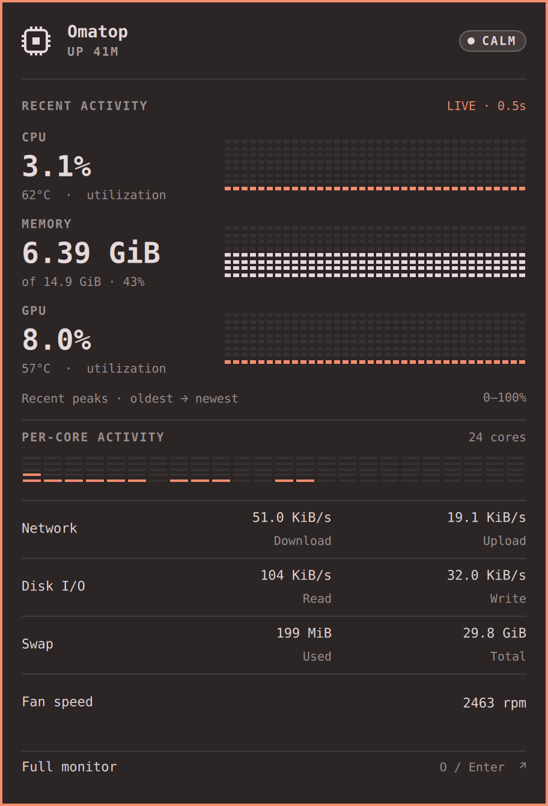

# Dropdown release review — v1.2.1

Release review, 2026-09-13. Screenshots show the live plugin on an empty
workspace using the current desktop theme.

- Replaced dropdown dials and sparklines with large readings and dot-matrix
  histories. Each history column preserves the peak of its sample group.
- Added a per-core equalizer. Cells fade between lit and dim over 180 ms;
  reduced motion disables the fades. Geometry and delegates remain fixed.
- The dropdown requests 2 Hz sampling while open and restores the configured
  interval on close. Supporting readings share the same ticks and retain their delegates.
- History labels use sample counts because the retained ring can contain
  samples from different cadences. The full monitor retains its instruments.
- Narrowed the dropdown from 480 to 456 logical pixels, standardized 16 px
  outer padding, and matched section labels and value typography. The footer
  is one full-width Full monitor action.
- Four full-width supporting rows align paired readings and explicitly label
  network download/upload, disk read/write,
  swap used/total, and fan speed. Byte units are binary (KiB/MiB/GiB); CPU/GPU
  temperatures show °C. GPU memory and battery are omitted from the dropdown.
  Pins remain in the full monitor; the dropdown omits them. A stopped fan
  displays 0 rpm.
- Fixed the sampler's immediate-reading deadline: opening during a slow
  interval previously left a long gap after the first fresh reading.

Validation: 69 Rust unit tests and 8 protocol tests pass. The new protocol
regression failed before the deadline fix. An isolated QML runtime check
confirmed live tick gaps of 497, 502, 499 and 501 ms, matrix peak/empty/invalid
input handling, nested surface counts, and restoration of a four-second idle
interval after repeated open/close. Both the dropdown and full monitor opened
in the running shell without plugin errors.

Short live measurements on the 5K display (20 seconds each), using
`docs/measure.py`. CPU is percent of one core; GPU busy is whole-device activity
and includes the rest of the desktop. These are indicative, not an isolated
GPU benchmark.

| Dropdown | Shell CPU | Sampler CPU | GPU busy mean |
| --- | ---: | ---: | ---: |
| Original, 1 Hz | 1.60% | 0.80% | 27.90% |
| Static dots, 2 Hz | 2.05% | 1.65% | 28.00% |
| Dots with 180 ms fades, 2 Hz | 5.79% | 1.45% | 28.10% |

The requested fades have a measurable CPU cost; this run does not establish
GPU savings. There is no continuous animation between sample transitions.

A subsequent [GPU investigation](gpu-investigation.md) isolated terminal
compositing and replaced per-cell fades with a shared 25 Hz clock, reducing
Omatop's measured GPU activity while preserving its subtle fades.
